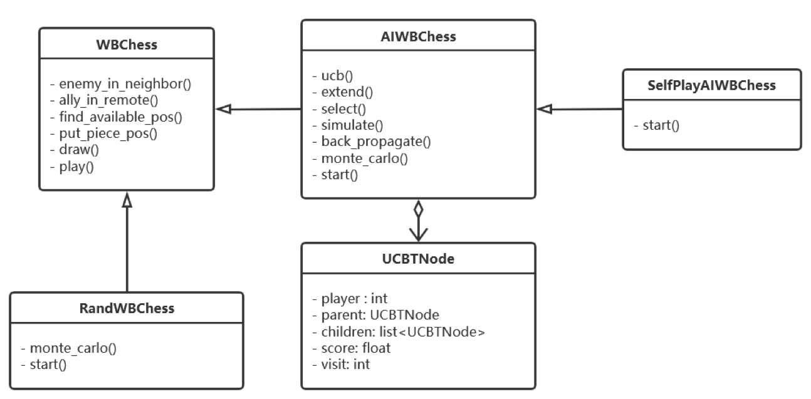
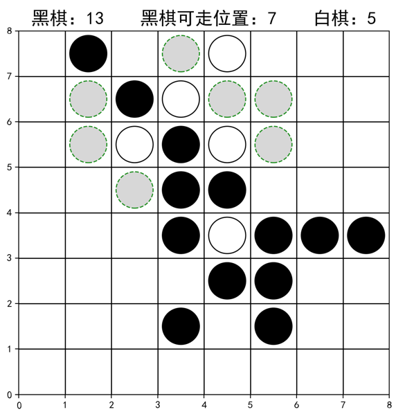

# Reversi-Chess
这只是一个简单的黑白棋小游戏，我设计了两人对战、人机对战、机器自动博弈的功能。
它的好处是可以在jupyter notebook中直接运行。不需要其他重量级的库。
它可以看作是`matplotlib`和`蒙特卡洛搜索树`算法的一个练手。
放在github上是因为我觉得它很有意思，经过一定次数的随机搜索之后机器的下棋能力比我厉害多了。
同时我觉得未来如果学强化学习还可以继续复用这个仓库。

# 类设计

# 界面

